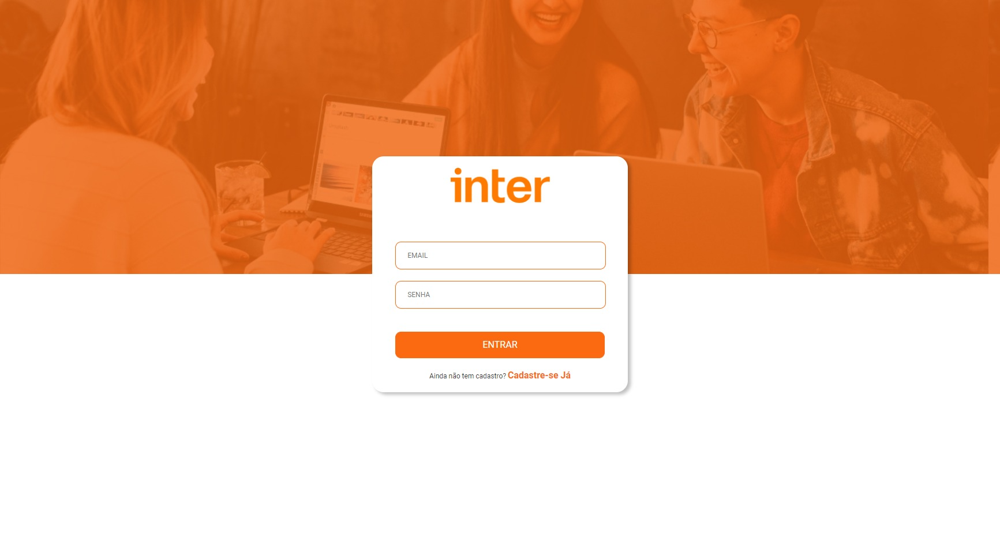
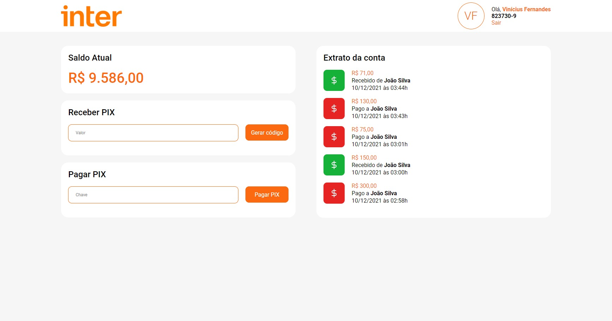
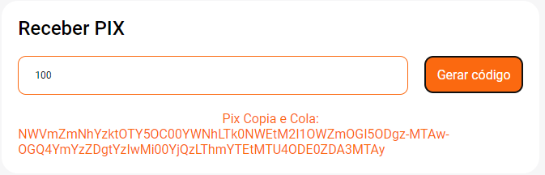
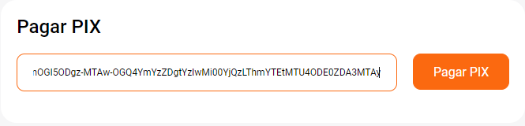

# App Inter - Semana Front-End Inter/DIO

Criado em plataforma React durante a Semana Front-End do [Banco Inter](https://www.bancointer.com.br) em parceria com a [DIO](https://digitalinnovation.one).

## 🤔 Resumo

Esta aplicação tem por objetivo replicar uma tela de login do Banco Inter, gerar chaves e realizar transações simuladas via PIX em banco de dados PostgreSQL controlado por TypeORM sobre plataforma React e uma estutura de backend apoiada em NodeJS e Express.

## 📷 Telas

<p align="center" style="display: flex; align-items: flex-start; justify-content: center;">
  
</p>

<p align="center" style="display: flex; align-items: flex-start; justify-content: center;">
  
</p>


## 📖 Documentação

As documentações mais detalhadas estão disponíveis em:

- [Frontend (dio-inter-front)](https://github.com/volinha/dio-inter-front)
- [Backend (dio-inter-backend)](https://github.com/volinha/dio-inter-backend)

## 🛠️ Principais Ferramentas

#### IDE:

- [Visual Studio Code](https://code.visualstudio.com)

#### Linguagem:

- [TypeScript](https://www.typescriptlang.org)

#### Backend:

- [CryptoJS](https://cryptojs.gitbook.io/docs/)
- [Express](https://expressjs.com/pt-br/)
- [js-base64](https://www.npmjs.com/package/js-base64)
- [JSON Web Tokens (JWT)](https://jwt.io)
- [nodeJS](https://nodejs.org/en/download/)
- [nodemon](https://www.npmjs.com/package/nodemon)
- [TypeORM](https://typeorm.io/#/)

#### Frontend:

- [axios](https://axios-http.com/docs/intro)
- [date-fns](https://date-fns.org)
- [React](https://pt-br.reactjs.org)
- [react-icons](https://react-icons.github.io/react-icons/)
- [React Router DOM](https://v5.reactrouter.com/web/guides/quick-start)
- [Styled Components](https://styled-components.com)

## ⌨️ Utilização

### Clonar o repositório:

``` bash
git clone https://github.com/volinha/inter-app
```

### Instalar e inicializar os servidores:

#### Frontend:

``` bash
cd .\frontend\
npm install
npm start
```

#### Backend:

- Instalar dependências e inicializar

``` bash
cd .\backend\
npm install
npm run start:dev
```

- Inicializar o servidor no `docker-compose`:

``` bash
docker-compose up -d
```

## ✨ Funcionalidades

### Gerar uma chave PIX
- Digite o valor a ser gerado no campo
- Clique em `Gerar código`
- Copie o código da chave

<p align="center" style="display: flex; align-items: flex-start; justify-content: center;">
  
</p>

### Pagar um PIX
- Clique em `Sair`
- Faça login como outro usuário
- Cole o código da chave e clique em `Pagar PIX`

<p align="center" style="display: flex; align-items: flex-start; justify-content: center;">
  
</p>

## 🚀 Em desenvolvimento

- Criação de usuário deve ser feita via Insomnia, instruções mais detalhadas disponíveis em [dio-inter-backend](https://github.com/volinha/dio-inter-backend), futuramente sendo implementada diretamente pelo frontend.
- Testes automatizados em JEST.
- Reorganização de algumas tipagens.

#### 💻 Desenvolvido por Vinícius Fernandes
[](https://www.facebook.com/viniciusfvb)
[](https://www.linkedin.com/in/viniciusfernandesdev/)
[](https://twitter.com/volafernandes)
<a href = "mailto:viniciusfernandesdev@gmail.com"></a>
<br />
