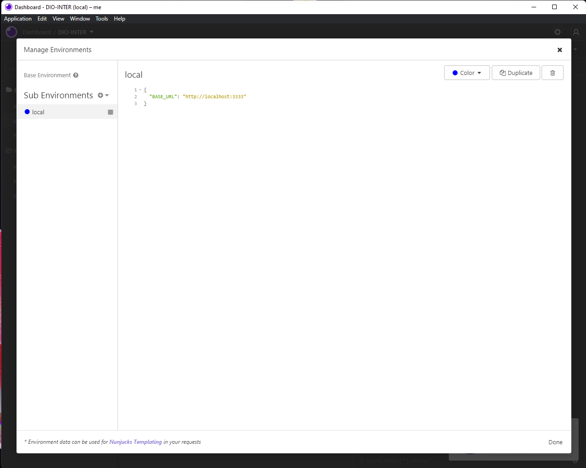
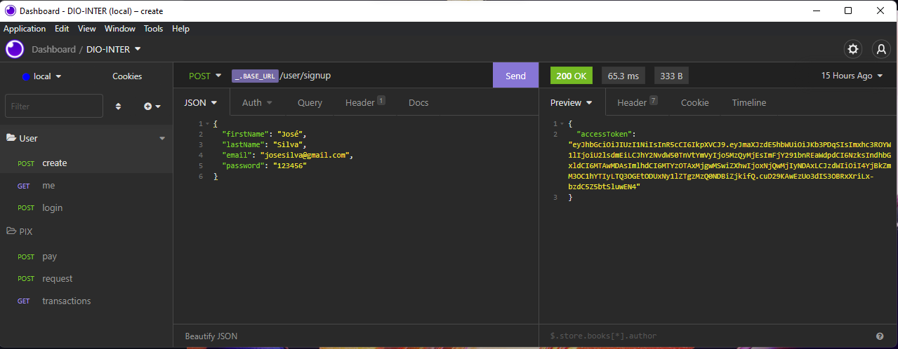
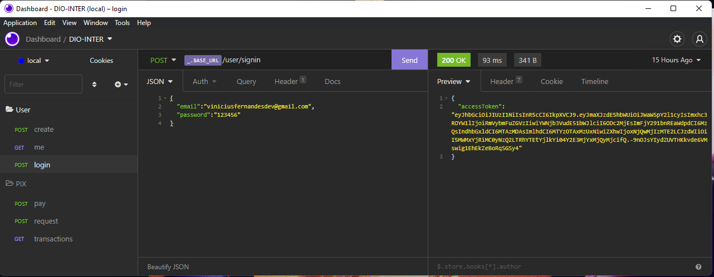
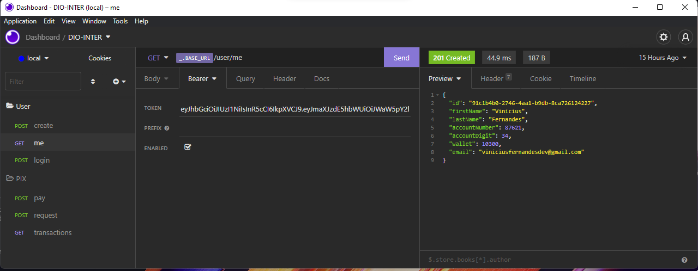
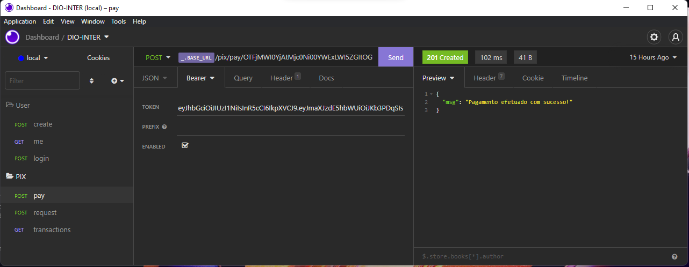
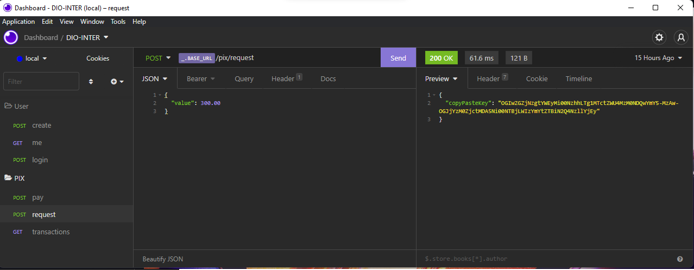
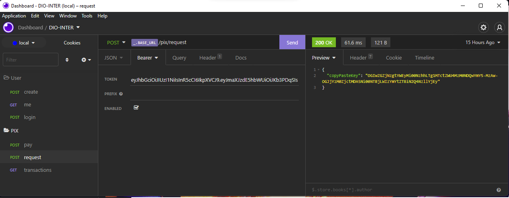
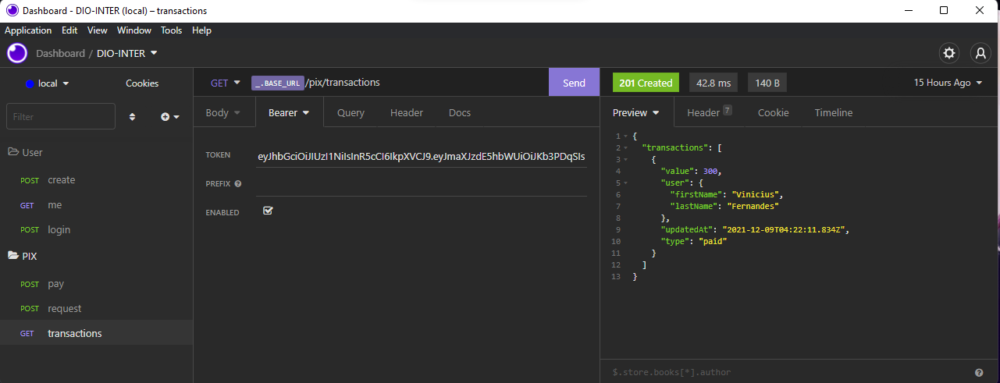

# Backend App Inter - Semana Front-End Inter/DIO

Criado em NodeJS, Express e REST API durante a Semana Front-End do [Banco Inter](https://www.bancointer.com.br) em parceria com a [DIO](https://digitalinnovation.one).
Banco de dados em [PostgreSQL](https://www.postgresql.org) gerenciado por [TypeORM](https://typeorm.io/#/).

## 🛠️ Ferramentas Necessárias

- [npm](https://www.npmjs.com)
- [NodeJS](https://nodejs.org/en/download/)
- [Docker](https://www.docker.com/get-started)
- [Visual Studio Code](https://code.visualstudio.com/download)
- [Insomnia](https://insomnia.rest/download)

## 📖 Instruções

- Clonar este repositório:

 ``` bash 
 git clone https://github.com/volinha/dio-inter-backend
 ```

- Abrir a pasta na IDE (ou interpretador de comandos) e executar o comando para instalar os módulos:

 ``` bash 
 npm install
 ```

- Subir a instância no docker-compose:

 ``` bash 
 docker-compose up -d
 ```

- Executar a aplicação

 ``` bash 
 npm run dev
 ```

# Utilização via Insomnia

## Criar variável de ambiente de desenvolvimento:
Para facilitar a criação e alteração das requisições futuras.

Atalho: `CTRL + E`
<p align="center" style="display: flex; align-items: flex-start; justify-content: center;">
  
</p>

Inserir a variável `_.BASE_URL` antes dos links das requisições.

## Criar requisições para `User` e `Pix`

### - User
- Create
<p align="center" style="display: flex; align-items: flex-start; justify-content: center;">
  
</p>

Para criar o usuário é necessário inserir o JSON com os seguintes campos:

``` bash
{
	"firstName": "Nome",
	"lastName": "Sobrenome",
	"email": "email@email.com",
	"password": "senha"
}
```

Gerando assim, o token do usuário criado, se já houver outro com o mesmo e-mail, retorna uma mensagem de erro.

- Login
<p align="center" style="display: flex; align-items: flex-start; justify-content: center;">
  
</p>

Para logar o usuário é necessário inserir o JSON com os seguintes campos:

``` bash
{
	"email": "email@email.com",
	"password": "senha"
}
```

Gerando assim, o token do usuário solicitado, se não houver o usuário ou a senha estiver incorreta, retorna uma mensagem de erro.

- Me
<p align="center" style="display: flex; align-items: flex-start; justify-content: center;">
  
</p>

Para retornar o usuário é necessário inserir o token no campo `Bearer`. 

Retornará as informações do usuário solicitado, se não validar o token, retorna uma mensagem de erro.

### - Pix
- Pay
<p align="center" style="display: flex; align-items: flex-start; justify-content: center;">
  
</p>

Para efetuar o pagamento é necessário as duas tokens, da solicitação e a do usuário que enviará a transação.

A token da solicitação é enviada no fim do próprio link, como por exemplo:

`{{ _.BASE_URL }}/pix/pay/OTFjMWI0YjAtMjc0Ni00YWExLWI5ZGItOGNhNzI2MTI0MjI3-MzAw-NDMzZjhiZGQtNDc0YS00YmY5LTkwZTctZjA1ZGE0ZjEyMmVl`

e a do usuário dentro do campo `TOKEN` na aba `Bearer`.

Gerando assim, a transação de pagamento. Se o token for inválido ou for o mesmo, retorna uma mensagem de erro.

- Request
<p align="center" style="display: flex; align-items: flex-start; justify-content: center;">
  
  
</p>

Para gerar a requisição é necessário um JSON com o valor:

``` bash
{
  "value": 100.00 
}
```
e o `Bearer` com o token do usuário.

Gerando assim, um token de pagamento. Se o token do usuário for inválido, retorna uma mensagem de erro.

- Transactions
<p align="center" style="display: flex; align-items: flex-start; justify-content: center;">
  
</p>

Para retornar o  de transações de um usuário é necessário a sua token dentro do campo `TOKEN` na aba `Bearer`.

Gerando assim, a histórico de pagamentos do usuário. Se o token for inválido ou for o mesmo, retorna uma mensagem de erro.

## Frameworks/IDEs/Libs

- [CryptoJS](https://cryptojs.gitbook.io/docs/)
- [Express](https://expressjs.com/pt-br/)
- [js-base64](https://www.npmjs.com/package/js-base64)
- [JSON Web Tokens (JWT)](https://jwt.io)
- [nodeJS](https://nodejs.org/en/download/)
- [nodemon](https://www.npmjs.com/package/nodemon)
- [TypeORM](https://typeorm.io/#/)
- [TypeScript](https://www.typescriptlang.org)
- [Visual Studio Code](https://code.visualstudio.com)

## Frontend App Inter - Semana Front-End Inter/DIO

Disponível em [dio-inter-front](https://github.com/volinha/dio-inter-front).

## Projeto Final App Inter - Semana Front-End Inter/DIO

Disponível em breve.

#### 💻 Desenvolvido por Vinícius Fernandes
[](https://www.facebook.com/viniciusfvb)
[](https://www.linkedin.com/in/viniciusfernandesdev/)
[](https://twitter.com/volafernandes)
<a href = "mailto:viniciusfernandesdev@gmail.com"></a>
<br />
